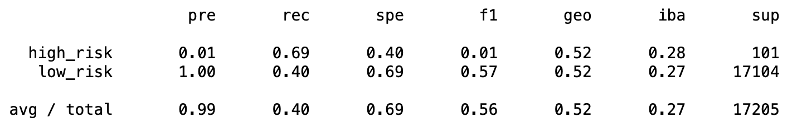

# Credit Risk Analysis

Machine Learning algorithms can help develop solutions for real world challenges. Credit risk is a type of problem which data is unbalanced, as there is a good amount of low risk loans that outnumber where the risk factor is high. For this analysis, various machine learning approach were used to work with the data, using re/over/under-sampling and different modeling techniques to compare overall performance. 

## Results 

Overall performance will be determined on the values of balanced accuracy, "defined as the average of recall obtained on each class"1, precision and recall (often referred as sensitivity) of the results.

The following list provides the model balanced accuracy score and below it, the imbalanced classification report for each one.

Resampling:
- Random sampler score: 0.67

- SMOTE sampler score: 0.66

- Cluster Centroids score: 0.54

- SMOTEENN score: 0.63

Ensemble: 
- RandomForest score: 0.79

- EasyEnsemble score: 0.93

## Summary 

Comparing the resampling models, the one noticeable difference is the Cluster Centroids method, which is an undersampling method and it did not prove a better accuracy score, this might be due the big difference in the amount of data for low-risk and high-risk. If data gets cut off from the training, the model is not able to predict correctly the "Low-risk" loans, neither.

It can be seen that regardless of the model, the performance on determining the "High-Risk" loans was poorly executed. The amount of data collected for this case is relevant as it depends the training capabilities of the models. 

The Easy Ensemble model provides the best accuracy score, though it could not be considered a reliable model as the prediction of high-risk loans is low and many applications could be wrongly classified.

1- [https://scikit-learn.org/stable/modules/generated/sklearn.metrics.balanced_accuracy_score.html](https://scikit-learn.org/stable/modules/generated/sklearn.metrics.balanced_accuracy_score.html)
